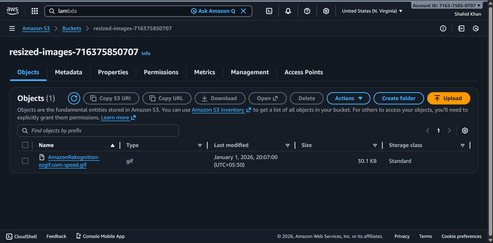
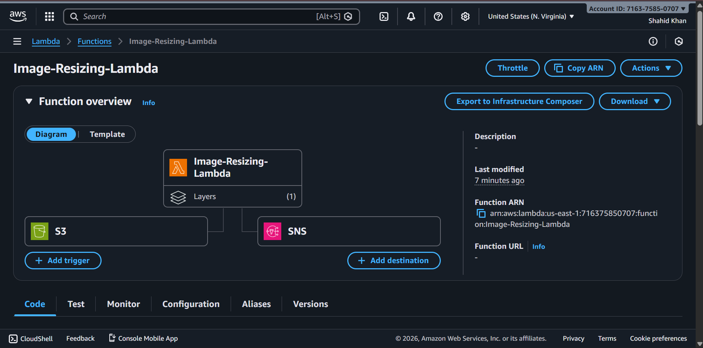
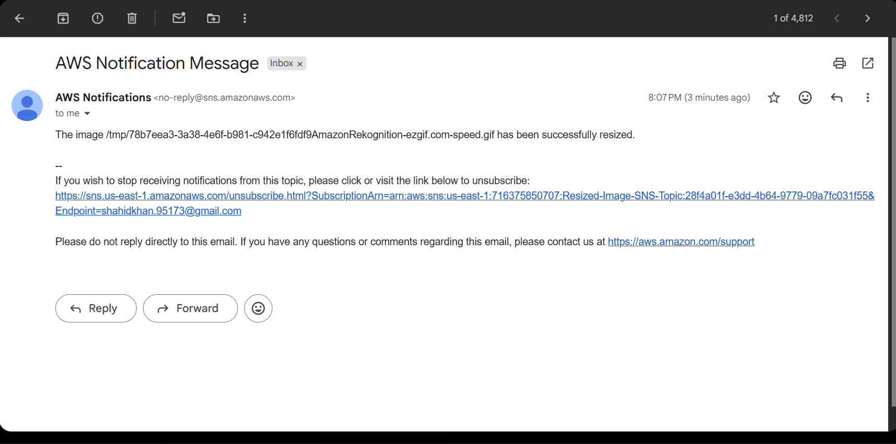

# Resize Image Using AWS Lambda, S3, and SNS

This project automatically resizes images uploaded to an S3 bucket using AWS Lambda, and sends notifications via SNS when the resizing is complete.

## Architecture Overview


## Project Description

This Terraform project sets up a serverless image resizing pipeline that:

- **Monitors** an S3 bucket for new image uploads
- **Triggers** an AWS Lambda function automatically when images are uploaded
- **Resizes** images using the Pillow library
- **Stores** resized images in a separate S3 bucket
- **Notifies** users via email when the resizing is complete

## Key Components

### 1. S3 Buckets

Two S3 buckets are created:

- **Source Bucket** (`image-need-to-resize`): Where users upload original images
  
  

- **Destination Bucket** (`image-resized`): Where resized images are stored
  
  

### 2. AWS Lambda Function

The Lambda function performs the image resizing:



- **Runtime**: Python 3.9
- **Memory**: 256 MB
- **Timeout**: 60 seconds
- **Layer**: Klayers-p39-pillow for image processing
- **Handler**: `CreateThumbnail.handler`

### 3. SNS Topic

Email notifications are sent when images are successfully resized:



- **Protocol**: Email
- **Subscriber**: Configured in `terraform.tfvars`

### 4. IAM Roles and Policies

Lambda execution role with policies to:
- Read from source S3 bucket
- Write to destination S3 bucket
- Publish to SNS topic

## Prerequisites

- AWS Account with appropriate credentials
- Terraform installed (v1.0+)
- Python 3.9+ (for local testing)
- AWS CLI configured

## Files Structure

```
.
├── providers.tf              # AWS provider configuration
├── variables.tf              # Variable definitions
├── terraform.tfvars         # Terraform variable values
├── locals.tf                # Local values
├── s3-bucket.tf             # S3 bucket resources
├── iam-role.tf              # IAM role definitions
├── iam-policy.tf            # IAM policy definitions
├── lambda-function.tf       # Lambda function resources
├── sns-topic.tf             # SNS topic and subscription
├── backend.tf               # Terraform backend configuration
├── CreateThumbnail.zip      # Lambda function code (zipped)
├── README.md                # This file
└── assets/                  # Architecture diagrams and screenshots
```

## Configuration

### 1. Update `terraform.tfvars`

```hcl
aws_access_key = "YOUR_AWS_ACCESS_KEY"
aws_secret_key = "YOUR_AWS_SECRET_KEY"
aws_region     = "us-east-1"
mail-id        = "your-email@example.com"
```

### 2. Variable Defaults

- `s3-bucket-lambda-code`: Source bucket for original images (auto-suffixed with account ID)
- `s3-bucket-dest`: Destination bucket for resized images (auto-suffixed with account ID)
- `sns-name`: SNS topic name
- `mail-id`: Email address for notifications

## Deployment

### Initialize Terraform

```bash
terraform init
```

### Plan the deployment

```bash
terraform plan
```

### Apply the configuration

```bash
terraform apply
```

When prompted, type `yes` to confirm.

## Usage

1. **Upload an image** to the source S3 bucket (`non-resized-image-[account-id]`)

2. **Lambda automatically triggers** and resizes the image

3. **Receive an email** notification with a link to the resized image in the destination bucket

4. **Access the resized image** from the destination bucket (`resized-images-[account-id]`)

## Lambda Function Logic

The `CreateThumbnail.handler` function:

1. Receives S3 event when image is uploaded
2. Downloads the original image from source bucket
3. Resizes the image to a thumbnail
4. Uploads the thumbnail to destination bucket
5. Publishes a message to SNS topic with the result

## Cleanup

To remove all resources created by this project:

```bash
terraform destroy
```

Type `yes` when prompted to confirm deletion.

## Security Considerations

- Store AWS credentials securely (use AWS IAM roles when possible)
- Restrict S3 bucket access to Lambda function only
- Use encryption for sensitive data in environment variables
- Monitor Lambda execution logs in CloudWatch

## Troubleshooting

### Lambda function fails

Check CloudWatch Logs:
```bash
aws logs tail /aws/lambda/Image-Resizing-Lambda --follow
```

### Email not received

1. Confirm SNS subscription by clicking the link in the confirmation email
2. Check spam/junk folder
3. Verify the email address in `terraform.tfvars`

### S3 bucket name already exists

The bucket names are auto-suffixed with your AWS account ID. If you still get conflicts, modify the `locals.tf` file to add a random suffix.

## Cost Estimation

- **Lambda**: ~$0.20 per 1 million requests
- **S3**: ~$0.023 per GB stored
- **SNS**: ~$0.50 per 1 million notifications
- **Data Transfer**: Varies by region

## License

This project is provided as-is for educational and demonstration purposes.

## Support

For issues or questions, please refer to the AWS documentation:
- [AWS Lambda Documentation](https://docs.aws.amazon.com/lambda/)
- [Amazon S3 Documentation](https://docs.aws.amazon.com/s3/)
- [Amazon SNS Documentation](https://docs.aws.amazon.com/sns/)
- [Terraform AWS Provider](https://registry.terraform.io/providers/hashicorp/aws/latest/docs)
